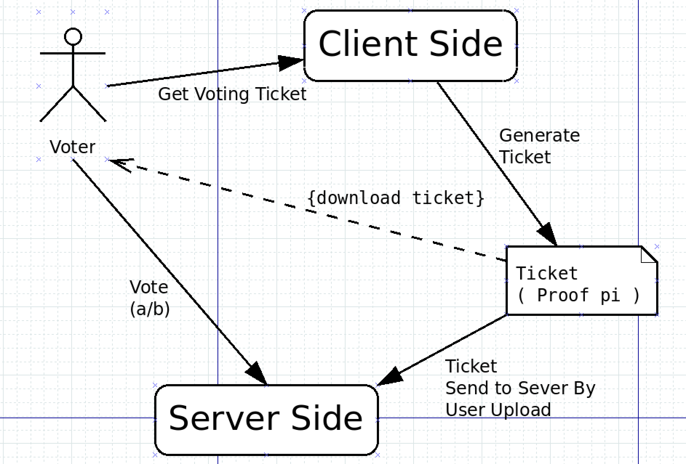

# Anonymous Voting System with zk-SNARKs

The **Anonymous Voting System** leverages zk-SNARKs (Zero-Knowledge Succinct Non-Interactive Arguments of Knowledge) to create a secure, private, and efficient blockchain-based voting mechanism. It aims to solve issues of traditional voting methods, such as high costs and lack of transparency, by enabling anonymous and tamper-proof voting.

## Overview

This project provides a decentralized voting system where voters can participate anonymously using zero-knowledge proofs. It ensures the following:

- **Privacy**: Voter identities and their choices remain confidential.
- **Security**: Votes are verified and tamper-proof, leveraging blockchain immutability.
- **Transparency**: Results are publicly verifiable without revealing individual votes.

### How It Works

1. **Voter Registration**: A list of eligible voters is created and managed by the system.
2. **Ticket Generation**: A unique, single-use voting ticket is generated for each voter using a zero-knowledge proof.
3. **Voting**: The voter uses the ticket to cast a vote, which is verified on the blockchain.
4. **Verification**: The vote is validated using zk-SNARKs to ensure the voter is eligible and the ticket hasn’t been reused.
5. **Result Compilation**: The votes are aggregated, and the final results are available for public verification.

### Key Features

- **One-Time Tickets**: Tickets are cryptographically bound to the voter list and validated using zk-SNARKs.
- **Zero-Knowledge Proofs**: Ensures that only eligible voters participate while maintaining complete anonymity.
- **Blockchain Integration**: Provides a transparent and immutable record of the voting process.

### Project Structure

- **Client Side**: Handles the user interface for generating tickets and submitting votes.
- **Server Side**: Manages voter registration, ticket validation, and vote tallying.
- **Blockchain**: Stores the vote data and ensures integrity through smart contracts.

### Running the Project

1. **Install Dependencies**: Follow the setup instructions to install all necessary tools and libraries.
2. **Setup the Environment**: Initialize the project and configure any blockchain or cryptographic dependencies.
3. **Run the System**:
   - Start the polling system.
   - Generate and download voting tickets.
   - Cast votes and verify results.

Refer to the full installation and execution guide in the documentation.
